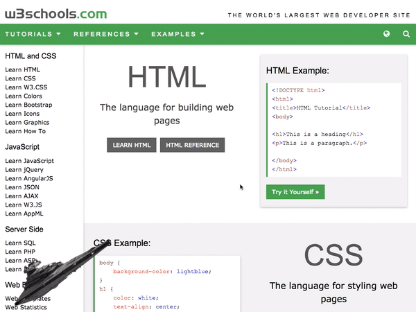

# Imperial Nav Destroyer

## What is this?
- This is a tool I created in my freetime to overlay the [Imperial Star Destroyer](http://starwars.wikia.com/wiki/Imperial_I-class_Star_Destroyer) on top of a webpage. For fun.
- This a code repository that is provided as-is without any warranty whatsoever.

## Have suggestions?
- Let me know if you have any cool ways to expand on this. I am always eager to connect with people passionate about Star Wars and technology.

## Attribution
- Credit to [W3 schools](https://www.w3schools.com/) for their SUPER useful website. Please don't sue me for using your website in an example.
- [wget](https://linux.die.net/man/1/wget) used to download webpage (see my [dotfiles repository](https://github.com/lshort2/dotFiles/blob/master/bash_aliases) for easier alias, "dlpage")
- Credit to [ezgif](https://ezgif.com/) for creating gif from screen recording.
